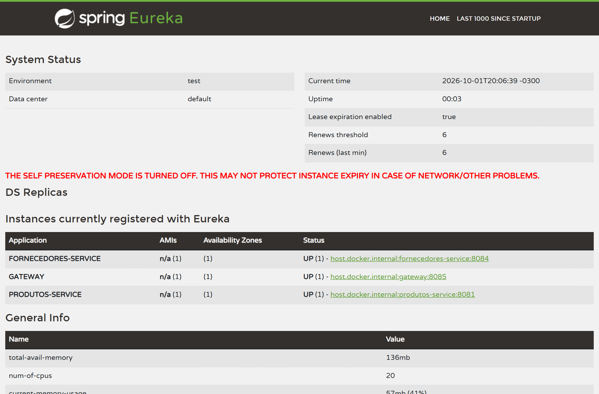
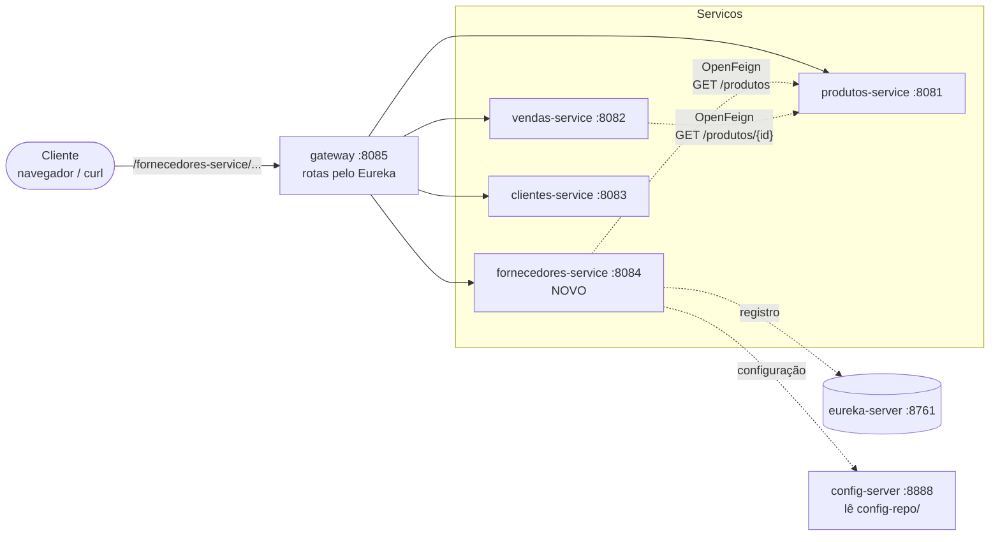

<div align="center">


# 🏭 API Vendas · fornecedores-service

**Um novo microsserviço ligado ao Eureka, ao Config Server, ao Gateway e ao produtos-service, com Docker Compose e CI no GitHub Actions**

<sub>DR3-AT · Bloco Engenharia de Softwares Escaláveis · Trabalho individual</sub>

<br/>

[](docs/RELATORIO_AT.md)

<br/>

[](https://github.com/andrebecker84/microservices-devops-api-vendas-AT/actions/workflows/fornecedores-service.yml)
[](#stack-tecnologica)
[](#stack-tecnologica)
[](#stack-tecnologica)
[](#endpoints)
[](#stack-tecnologica)
[](#como-executar)
[](LICENSE)
[](#estado-do-projeto)

<br/>



<sub>Painel do Eureka com o fornecedores-service registrado ao lado do gateway e do produtos-service.</sub>

</div>

---

<a id="identificacao"></a>

Aluno: André Luis Becker · Matrícula (CPF): `***.***.***-**` (não publicada por proteção de dados pessoais, LGPD; o número é informado ao professor se ele solicitar)

> [!NOTE]
> **Por que a matrícula não aparece.** No Instituto Infnet, a matrícula do aluno é o CPF. Este
> repositório é público, e o histórico do Git guarda cada commit para sempre, mesmo que a linha seja
> apagada depois. Por isso **nenhum dígito do CPF é publicado**, nem os seis dígitos do meio que o
> governo exibe em documentos públicos: um CPF parcial ao lado do nome completo já facilita fraude e
> engenharia social, e máscaras diferentes, publicadas em lugares diferentes, podem ser cruzadas até
> reconstruir o número inteiro. É o princípio da necessidade da LGPD (Lei nº 13.709/2018, art. 6º,
> III): tratar só o dado necessário à finalidade. O aluno fica identificado pelo nome completo e pela
> conta do GitHub, e o número é informado ao professor mediante solicitação.

---

<a id="indice"></a>

## 📚 Índice

| | O serviço | | Qualidade e entrega |
|:---:|---|:---:|---|
| 01 | [Visão geral](#visao-geral) | 07 | [Integração contínua](#ci) |
| 02 | [Arquitetura](#arquitetura) | 08 | [Testes automatizados](#testes) |
| 03 | [Stack tecnológica](#stack-tecnologica) | 09 | [Atendimento à rúbrica](#atendimento) |
| 04 | [Como executar](#como-executar) | 10 | [Estrutura do projeto](#estrutura) |
| 05 | [Endpoints do fornecedores-service](#endpoints) | 11 | [Estado do projeto](#estado-do-projeto) |
| 06 | [Roteiro dos 12 exercícios](#roteiro) | 12 | [Licença](#licenca) |

---

<a id="visao-geral"></a>

## 💡 Visão geral

Este repositório é um **fork** do projeto feito em sala. Nele foi criado um novo microsserviço, o
**fornecedores-service**, ligado a tudo o que já existia:

- registra-se no **Eureka** e recebe porta, banco e endereço do Eureka do **Config Server**;
- guarda fornecedores num **H2** em memória, com cinco registros criados na subida;
- expõe `GET /fornecedores`, `GET /fornecedores/{id}` (com `404`) e `POST /fornecedores` (com `201`);
- valida o CNPJ pelos dígitos verificadores, inclusive no formato alfanumérico que a Receita emite
  desde julho de 2026, e trata como o mesmo CNPJ as grafias com e sem máscara;
- consulta o **produtos-service** por **OpenFeign** em `GET /fornecedores/produtos`;
- é alcançado pelo **Gateway** na porta 8085, sem nenhuma rota escrita à mão;
- sobe com todo o resto num único `docker compose up --build`;
- é compilado e testado pelo **GitHub Actions** a cada push.

> **Bloco:** Engenharia de Softwares Escaláveis  
> **Disciplina:** Microsserviços e DevOps com Spring Boot e Spring Cloud [26E3_3]  
> **Trimestre:** 26E2  
> **Professor:** Wesley Bruno Barbosa Silva  
> **Aluno:** André Luis Becker  
> **Sala:** GRLENGR2C2-N2-L1  
> **Modalidade:** Individual

> **Repositório:** https://github.com/andrebecker84/microservices-devops-api-vendas-AT  
> **Branch da atividade:** [`atividade-andrebecker`](https://github.com/andrebecker84/microservices-devops-api-vendas-AT/tree/atividade-andrebecker)

> [!IMPORTANT]
> **Base do trabalho:** fork de [`brunowbbs2/api-vendas`](https://github.com/brunowbbs2/api-vendas),
> branch **`V5`**, que é o projeto de sala (`spring-microservices-exercicio`) que o enunciado manda
> usar. A `main` do fork aponta para a V5, e todo o trabalho está na branch `atividade-andrebecker`,
> com Pull Request aberto para a `main`.
>
> **Continuidade do TP3.** Este AT continua o meu
> [TP3](https://github.com/andrebecker84/microservices-devops-api-vendas-TP3), que partiu da mesma
> V5. Vieram dele as correções do ambiente herdado, a migração para Spring Boot 4 e Spring Cloud
> 2025, a disciplina de testes e o formato de entrega. O código do TP3 não é a base porque, no TP3:
> - a porta 8084 está ocupada pelo `auth-service`;
> - todas as rotas exigem JWT;
> - o clientes-service e o vendas-service, que o enunciado manda copiar, já não usam H2, JPA e Feign.
>
> **Branch `v10` do professor.** Foi conferida commit a commit. Ela também usa a 8084 com um
> `auth-service` e protege o gateway com JWT. Em relação ao enunciado e à rúbrica, ela não substitui
> esta entrega, porque não tem o fornecedores-service. A comparação rendeu um ajuste no ConfigMap do
> Kubernetes. A justificativa completa e a leitura adotada para cada ponto ambíguo do enunciado estão
> na [seção 1 do relatório](docs/RELATORIO_AT.md#1-planejamento).
>
> Guias de referência da disciplina, publicados pelo professor:
> [Microsserviços](https://claude.ai/code/artifact/2c541174-0b49-486d-9ee2-1682e91b8daf) ·
> [Docker](https://claude.ai/code/artifact/a5f3c8e5-81de-4791-a16c-a71d4aa45f0f) ·
> [Kubernetes](https://claude.ai/code/artifact/68cd2944-af3d-430f-8e6f-ea27c4186982)

<p align="right"><a href="#indice">⬆ voltar ao índice</a></p>

---

<a id="arquitetura"></a>

## 🏗️ Arquitetura



### 🧩 Serviços e portas

| Serviço | Porta | Papel |
|---|:---:|---|
| `fornecedores-service` (**novo**) | 8084 | Cadastro de fornecedores (H2) e consulta de produtos via Feign |
| `produtos-service` | 8081 | Catálogo de produtos (H2) |
| `vendas-service` | 8082 | Registro de vendas, consulta o produtos-service via Feign |
| `clientes-service` | 8083 | Cadastro de clientes (H2); **modelo copiado** para criar o fornecedores |
| `gateway` | 8085 | Spring Cloud Gateway: `http://localhost:8085/<nome-do-servico>/...` |
| `eureka-server` | 8761 | Service discovery |
| `config-server` | 8888 | Configuração centralizada, lida de `config-repo/` |

### 🔌 Como o fornecedores-service se conecta

| Ligação | Como | Onde |
|---|---|---|
| Config Server | `spring.config.import=optional:configserver:http://localhost:8888`; o resto da configuração vem de `config-repo/fornecedores-service.properties` | [`application.properties`](fornecedores-service/src/main/resources/application.properties) |
| Eureka | dependência `spring-cloud-starter-netflix-eureka-client` e `eureka.client.service-url.defaultZone` no config-repo | [`pom.xml`](fornecedores-service/pom.xml), [`fornecedores-service.properties`](config-repo/fornecedores-service.properties) |
| Gateway | nenhuma rota escrita: o *discovery locator* cria `/fornecedores-service/**` a partir do nome registrado no Eureka | [`gateway/application.properties`](gateway/src/main/resources/application.properties) |
| produtos-service | `@FeignClient(name = "produtos-service")`, resolvido pelo LoadBalancer via Eureka | [`ProdutoClient`](fornecedores-service/src/main/java/com/exemplo/fornecedoresservice/client/ProdutoClient.java) |
| Docker | perfil `docker` troca `localhost` por `eureka-server` | [`fornecedores-service-docker.properties`](config-repo/fornecedores-service-docker.properties) |

<p align="right"><a href="#indice">⬆ voltar ao índice</a></p>

---

<a id="stack-tecnologica"></a>

## 🛠️ Stack tecnológica

Todas as tecnologias estão na versão estável mais recente, em todos os módulos, e não apenas no
serviço novo.

| Item | Versão | Observação |
|---|---|---|
| Java | **25 (LTS)** | Nível de código, imagens Docker e GitHub Actions |
| Spring Boot | **4.1.1** | Todos os módulos. Na V5, eureka, config, produtos e clientes ainda estavam no 3.2.5 |
| Spring Cloud | **2025.1.3** | Eureka, Config, Gateway (WebFlux), OpenFeign, LoadBalancer |
| Persistência | Spring Data JPA · Hibernate 7 · H2 2.4 | H2 em memória, um banco por serviço |
| Testes | JUnit 5, MockMvc, Mockito, AssertJ, WireMock | 28 no fornecedores-service, 6 no vendas-service |
| Build | Maven 3.9 | Um projeto Maven por serviço |
| Imagem de build | `maven:3.9-eclipse-temurin-25` | Multi-stage |
| Imagem de runtime | `eclipse-temurin:25-jre` | Só JRE e o jar |
| CI | GitHub Actions: `actions/checkout@v7`, `actions/setup-java@v6` | A cada push |

> [!IMPORTANT]
> **Java 25 no lugar do Java 17.** O enunciado (Exercício 12) e a rúbrica (critério 5.3) citam o
> Java 17, a versão usada em sala. Esta entrega usa o **Java 25**, a LTS mais recente, por decisão
> deliberada de manter todas as tecnologias na versão estável mais atual:
>
> - **É uma LTS, como o 17.** O Java 25 é a versão de suporte estendido seguinte ao 17 e ao 21; não
>   é uma versão experimental.
> - **O requisito continua cumprido.** O que o critério 5.3 avalia é o workflow configurar o JDK
>   antes de compilar. O `actions/setup-java` faz exatamente isso, com a versão 25.
> - **O código é compatível com o 17.** Nada nele é exclusivo do 25, e o Spring Boot 4 roda a
>   partir do Java 17. Voltar para o 17 é trocar um número no `pom.xml` e no workflow.
> - **Há coerência entre os ambientes.** `pom.xml`, workflow e imagens Docker usam a mesma versão:
>   o que compila no CI é o que roda no container.

<p align="right"><a href="#indice">⬆ voltar ao índice</a></p>

---

<a id="como-executar"></a>

## ▶️ Como executar

### Pré-requisitos

- JDK 25 e Maven 3.9+ para rodar localmente.
- Docker com Docker Compose para subir tudo em containers.

### Opção 1: localmente, um terminal por serviço

A ordem importa: Eureka e Config Server primeiro, porque os outros buscam neles a configuração e o
registro.

```powershell
cd eureka-server;        mvn spring-boot:run   # 1. http://localhost:8761
cd config-server;        mvn spring-boot:run   # 2. http://localhost:8888
cd produtos-service;     mvn spring-boot:run   # 3. porta 8081
cd fornecedores-service; mvn spring-boot:run   # 4. porta 8084
cd gateway;              mvn spring-boot:run   # 5. porta 8085
```

> [!TIP]
> O config-server lê a pasta `config-repo/` por caminho relativo (backend `native`), então funciona
> em qualquer máquina, rodando de dentro de `config-server/` ou da raiz do projeto.

### Opção 2: tudo no Docker, com um único comando

```bash
docker compose up --build
```

Sobem sete containers: `eureka-server`, `config-server`, `produtos-service`, `vendas-service`,
`clientes-service`, `fornecedores-service` e `gateway`. O Compose espera o Eureka e o Config
Server ficarem **prontos** (healthcheck) antes de subir os serviços.

```bash
docker compose ps
```

> [!WARNING]
> Depois que tudo sobe, **espere cerca de 30 segundos** antes de chamar o gateway. Cada serviço leva
> esse tempo para aparecer no Eureka, e o gateway só cria a rota depois disso. Antes, a resposta é
> `404` ou `503`; basta repetir.

Para derrubar:

```bash
docker compose down
```

### ☸️ Kubernetes

O manifesto [`k8s/07-fornecedores-service.yaml`](k8s/07-fornecedores-service.yaml) segue o mesmo
padrão dos demais serviços, e o passo a passo está em [`k8s/README.md`](k8s/README.md). Ele não faz
parte das evidências: o enunciado pede a execução no Docker Compose.

<p align="right"><a href="#indice">⬆ voltar ao índice</a></p>

---

<a id="endpoints"></a>

## 🔌 Endpoints do fornecedores-service

| Método | Rota direta (8084) | Pelo gateway (8085) | Resposta |
|---|---|---|---|
| `GET` | `/fornecedores` | `/fornecedores-service/fornecedores` | `200` com a lista |
| `GET` | `/fornecedores/{id}` | `/fornecedores-service/fornecedores/{id}` | `200` com o fornecedor · `404` se o id não existe |
| `POST` | `/fornecedores` | `/fornecedores-service/fornecedores` | `201` com o fornecedor criado e o header `Location` · `400` sem nome, sem CNPJ ou CNPJ inválido · `409` CNPJ já cadastrado |
| `GET` | `/fornecedores/produtos` | `/fornecedores-service/fornecedores/produtos` | `200` com os produtos do produtos-service · `503` se ele estiver fora do ar |
| — | `/h2-console` | — | Console do H2 (JDBC URL `jdbc:h2:mem:fornecedoresdb`, usuário `sa`, sem senha) |

### Exemplos

```bash
# lista (os cinco fornecedores da carga inicial)
curl -i http://localhost:8084/fornecedores

# id inexistente -> 404
curl -i http://localhost:8084/fornecedores/99

# cadastro -> 201 com o id gerado
curl -i -X POST http://localhost:8084/fornecedores \
  -H "Content-Type: application/json" \
  -d '{"nome":"Zeta Componentes Ltda","cnpj":"65.123.478/0001-54"}'

# produtos obtidos do produtos-service via Feign
curl -i http://localhost:8084/fornecedores/produtos

# a mesma lista, agora pelo gateway
curl -i http://localhost:8085/fornecedores-service/fornecedores
```

No PowerShell, use `curl.exe` nos `GET` (o `curl` do PowerShell é outro comando). Para o `POST`,
o `Invoke-WebRequest` evita o problema das aspas no JSON e funciona igual no PowerShell 5.1 e no 7:

```powershell
Invoke-WebRequest -UseBasicParsing -Method Post http://localhost:8084/fornecedores `
  -ContentType "application/json" `
  -Body '{"nome":"Zeta Componentes Ltda","cnpj":"65.123.478/0001-54"}'
```

Resposta do `POST`:

```http
HTTP/1.1 201
Location: /fornecedores/6
Content-Type: application/json

{"id":6,"nome":"Zeta Componentes Ltda","cnpj":"65.123.478/0001-54"}
```

O arquivo [`demo/fornecedores.http`](demo/fornecedores.http) tem as mesmas requisições para o HTTP
Client do IntelliJ.

> [!NOTE]
> O `POST` sempre cria. O corpo é um `FornecedorRequest` só com `nome` e `cnpj`: um `id` no JSON é
> ignorado. Se a entidade fosse recebida direto, o `save()` do JPA atualizaria o fornecedor
> existente com aquele id.
>
> O CNPJ pode vir com ou sem máscara (`65123478000154` ou `65.123.478/0001-54`) e é sempre gravado
> e devolvido formatado. Dígito verificador errado dá `400`; o mesmo número em outra grafia dá `409`.
> Todos os erros saem no formato Problem Details (RFC 9457).

<p align="right"><a href="#indice">⬆ voltar ao índice</a></p>

---

<a id="roteiro"></a>

## 🧭 Roteiro dos 12 exercícios

Cada exercício do [enunciado](docs/context/enunciado-DR3-AT.md), onde foi feito e qual evidência o
comprova. As capturas ficam em [`docs/evidencias/`](docs/evidencias/), e o detalhamento está no
[relatório técnico](docs/RELATORIO_AT.md).

| # | Exercício | Implementação | Evidência |
|:---:|---|---|---|
| 1 | Fork, clone, Eureka com o produtos-service | fork de `brunowbbs2/api-vendas` (V5) | `01-eureka-produtos.png` |
| 2 | Branch `atividade-andrebecker`, `readme.md`, Pull Request | linha de identificação no [`readme.md`](readme.md), repetida no topo deste arquivo | `02-pull-request.png` |
| 3 | Cópia do clientes-service na porta 8084 | [`fornecedores-service/`](fornecedores-service/): `artifactId`, `name`, pacote `com.exemplo.fornecedoresservice`, classe `FornecedoresServiceApplication` | `03-fornecedores-8084.png` |
| 4 | Entidade, repositório e cinco registros | [`Fornecedor`](fornecedores-service/src/main/java/com/exemplo/fornecedoresservice/model/Fornecedor.java), [`FornecedorRepository`](fornecedores-service/src/main/java/com/exemplo/fornecedoresservice/repository/FornecedorRepository.java), [`DataInitializer`](fornecedores-service/src/main/java/com/exemplo/fornecedoresservice/config/DataInitializer.java) | `04-h2-console.png` |
| 5 | Service e controller, `GET` com `404` | [`FornecedorService`](fornecedores-service/src/main/java/com/exemplo/fornecedoresservice/service/FornecedorService.java), [`FornecedorController`](fornecedores-service/src/main/java/com/exemplo/fornecedoresservice/controller/FornecedorController.java) | `05-get-fornecedores.png`, `06-get-404.png` |
| 6 | Registro no Eureka | dependência no `pom.xml` e propriedades `eureka.*` no config-repo | `07-eureka-fornecedores.png` |
| 7 | Configuração no Config Server | [`config-repo/fornecedores-service.properties`](config-repo/fornecedores-service.properties); `application.properties` só com nome e config-server | `08-config-server.png`, `09-porta-config-server.png` |
| 8 | Acesso pelo gateway | `http://localhost:8085/fornecedores-service/fornecedores` | `10-gateway-8085.png` |
| 9 | `POST /fornecedores` com `201` | `FornecedorController.cadastrar`, [`FornecedorRequest`](fornecedores-service/src/main/java/com/exemplo/fornecedoresservice/dto/FornecedorRequest.java), [`Cnpj`](fornecedores-service/src/main/java/com/exemplo/fornecedoresservice/model/Cnpj.java) | `11-post-201.png` |
| 10 | Feign para o produtos-service | [`ProdutoClient`](fornecedores-service/src/main/java/com/exemplo/fornecedoresservice/client/ProdutoClient.java), [`ProdutoDTO`](fornecedores-service/src/main/java/com/exemplo/fornecedoresservice/dto/ProdutoDTO.java), [`CatalogoProdutos`](fornecedores-service/src/main/java/com/exemplo/fornecedoresservice/service/CatalogoProdutos.java), `@EnableFeignClients` | `12-feign-produtos.png` |
| 11 | Dockerfile, perfil docker, Compose | [`Dockerfile`](fornecedores-service/Dockerfile), [`fornecedores-service-docker.properties`](config-repo/fornecedores-service-docker.properties), [`docker-compose.yml`](docker-compose.yml) | `13-compose-ps.png`, `14-compose-gateway.png` |
| 12 | GitHub Actions | [`.github/workflows/fornecedores-service.yml`](.github/workflows/fornecedores-service.yml) | `15-actions.png` |

<p align="right"><a href="#indice">⬆ voltar ao índice</a></p>

---

<a id="ci"></a>

## 🔁 Integração contínua

O workflow [`fornecedores-service.yml`](.github/workflows/fornecedores-service.yml) roda **a cada
push**, em qualquer branch, e também pode ser disparado à mão pela aba Actions:

| Etapa | Ação |
|---|---|
| Baixar o código | `actions/checkout@v7` |
| Instalar o Java | `actions/setup-java@v6`, distribuição Temurin, versão 25, com cache do Maven |
| Compilar | `mvn -B verify` dentro de `fornecedores-service/`: compila, roda os testes e gera o `.jar` |
| Relatório | os resultados dos testes ficam anexados à execução (`relatorio-testes`) |

Os testes não dependem de nenhum outro serviço no ar: Eureka e Config Server ficam desligados, o
banco é o H2 e o produtos-service é substituído por um mock do cliente Feign. Por isso o pipeline
roda no runner do GitHub sem subir a infraestrutura.

O token do pipeline só tem permissão de leitura (`permissions: contents: read`), um push novo na
mesma branch cancela a execução anterior e o job tem limite de 15 minutos.

<p align="right"><a href="#indice">⬆ voltar ao índice</a></p>

---

<a id="testes"></a>

## ✅ Testes automatizados

```bash
cd fornecedores-service
mvn test
```

[`FornecedorControllerTest`](fornecedores-service/src/test/java/com/exemplo/fornecedoresservice/controller/FornecedorControllerTest.java)
sobe a aplicação inteira (`@SpringBootTest` + MockMvc) com a carga inicial real. Cada teste roda numa
transação desfeita no final:

| Teste | Verifica |
|---|---|
| `listaOsCincoFornecedoresCadastradosNaSubida` | `GET /fornecedores` → `200` com os cinco registros |
| `buscaFornecedorPorId` | `GET /fornecedores/2` → `200` |
| `idInexistenteDevolve404` | `GET /fornecedores/999` → `404` |
| `postCriaFornecedorEDevolve201ComOObjetoCriado` | `POST` → `201` com `Location`, e o novo registro aparece na listagem |
| `postGuardaOCnpjFormatadoMesmoQuandoEnviadoSemMascara` | `65123478000154` volta como `65.123.478/0001-54` |
| `postIgnoraIdEnviadoNoCorpoENaoSobrescreveRegistroExistente` | um `id` no JSON não sobrescreve o fornecedor 1 |
| `postComCnpjRepetidoDevolve409` | CNPJ único → `409` |
| `cnpjRepetidoEmOutraGrafiaTambemDevolve409` | o mesmo CNPJ sem máscara também → `409` |
| `postComCnpjInvalidoDevolve400` | dígito verificador errado → `400` |
| `postSemCnpjDevolve400` | CNPJ obrigatório → `400` |
| `postComJsonMalformadoDevolve400` | corpo inválido → `400` |
| `listaProdutosObtidosDoProdutosServiceViaFeign` | `GET /fornecedores/produtos` devolve o que o cliente Feign trouxe |
| `produtosServiceForaDoArDevolve503` | falha do Feign vira `503`, e não `500` |

[`ProdutoClientFeignTest`](fornecedores-service/src/test/java/com/exemplo/fornecedoresservice/client/ProdutoClientFeignTest.java)
testa o Feign de verdade, sem mock: o **WireMock** faz o papel do produtos-service e o nome é
resolvido pelo LoadBalancer. Cobre a conversão do JSON, o `500` remoto virando `503` e o timeout de
leitura, com um produtos-service lento.

[`CnpjTest`](fornecedores-service/src/test/java/com/exemplo/fornecedoresservice/model/CnpjTest.java)
testa o objeto de valor `Cnpj` sozinho: grafias equivalentes, formatação, o CNPJ alfanumérico do
exemplo da Receita (`12.ABC.345/01DE-35`) e nove entradas inválidas.

No vendas-service, [`VendaControllerTest`](vendas-service/src/test/java/com/example/vendas_service/controllers/VendaControllerTest.java)
cobre a venda com `201`, produto inexistente com `422`, produtos-service fora do ar com `503` e
quantidade inválida com `400`.

Resultado da última execução: **35 testes, todos passando** (28 no fornecedores-service, 6 no
vendas-service e 1 no gateway).

<p align="right"><a href="#indice">⬆ voltar ao índice</a></p>

---

<a id="atendimento"></a>

## 🎯 Atendimento à rúbrica

| Competência | Critério | Onde |
|---|---|---|
| **1. Spring Boot e Spring Cloud** | `pom.xml`, pacotes e porta 8084 | [`fornecedores-service/pom.xml`](fornecedores-service/pom.xml), pacote `com.exemplo.fornecedoresservice`, `server.port=8084` no config-repo |
| | Registro no Eureka | `spring-cloud-starter-netflix-eureka-client` + `@EnableDiscoveryClient`; Figura 7 |
| | Configuração externalizada | [`config-repo/fornecedores-service.properties`](config-repo/fornecedores-service.properties); Figuras 8 e 9 |
| | OpenFeign | [`ProdutoClient`](fornecedores-service/src/main/java/com/exemplo/fornecedoresservice/client/ProdutoClient.java) + `@EnableFeignClients`; Figura 12 |
| **2. Docker** | Dockerfile com a porta certa | [`fornecedores-service/Dockerfile`](fornecedores-service/Dockerfile), `EXPOSE 8084` |
| | Perfil docker apontando o Eureka | [`fornecedores-service-docker.properties`](config-repo/fornecedores-service-docker.properties): `http://eureka-server:8761/eureka/` |
| | Bloco no `docker-compose.yml` | serviço `fornecedores-service`, porta `8084:8084`, perfil `docker` |
| | Comando único e acesso pelo gateway | `docker compose up --build`; Figuras 13 e 14 |
| **3. Endpoints** | Entidade, repositório e cinco registros | `Fornecedor`, `FornecedorRepository`, `DataInitializer`; Figura 4 |
| | `GET` com `404` | `FornecedorController`; Figuras 5 e 6 |
| | `POST` com `201` | `FornecedorController.criar`; Figura 11 |
| | Acesso pelo gateway na 8085 | *discovery locator*; Figura 10 |
| **4. Git e GitHub** | Fork e clone | fork de `brunowbbs2/api-vendas`; Figura 1 |
| | Branch `atividade-seunome` | `atividade-andrebecker` |
| | `readme.md` com nome e matrícula | linha acrescentada ao [`readme.md`](readme.md) do professor, sem o CPF, por proteção de dados ([por quê](#identificacao)) |
| | Push e Pull Request para a `main` do fork | Figura 2 |
| **5. GitHub Actions** | `.github/workflows` com o YAML | [`fornecedores-service.yml`](.github/workflows/fornecedores-service.yml) |
| | Gatilho a cada push | `on: push` |
| | Checkout e Java | `actions/checkout@v7`, `actions/setup-java@v6` com Java 25 no lugar do 17 ([justificativa](#stack-tecnologica)) |
| | Compilação com Maven e check verde | `mvn -B verify`; Figura 15 |

<p align="right"><a href="#indice">⬆ voltar ao índice</a></p>

---

<a id="estrutura"></a>

## 📁 Estrutura do projeto

```text
microservices-devops-api-vendas-AT/
├── fornecedores-service/         # NOVO · porta 8084 · JPA + H2 + Eureka + Config + Feign
├── produtos-service/             # produtos (8081)
├── vendas-service/               # vendas (8082), Feign para produtos
├── clientes-service/             # clientes (8083), modelo do fornecedores
├── gateway/                      # Spring Cloud Gateway (8085)
├── eureka-server/                # service discovery (8761)
├── config-server/                # configuração centralizada (8888)
├── config-repo/                  # .properties servidos pelo config-server
├── k8s/                          # manifestos do Kubernetes
├── demo/                         # fornecedores.http (IntelliJ)
├── docs/
│   ├── RELATORIO_AT.md           # relatório técnico
│   ├── context/                  # enunciado e rúbrica
│   └── evidencias/               # capturas pedidas pelo enunciado
├── .github/workflows/            # CI do fornecedores-service
├── docker-compose.yml
├── LICENSE
├── readme.md                     # readme do professor + identificação (Exercício 2)
└── README_AT.md                  # este arquivo: documentação completa
```

<p align="right"><a href="#indice">⬆ voltar ao índice</a></p>

---

<a id="estado-do-projeto"></a>

## 📌 Estado do projeto

Entrega concluída. O detalhamento de cada exercício está em
[`docs/RELATORIO_AT.md`](docs/RELATORIO_AT.md), com as quinze evidências pedidas pelo enunciado em
[`docs/evidencias/`](docs/evidencias/).

### O que mudou em relação à V5

| Arquivo / pasta | Mudança |
|---|---|
| `fornecedores-service/` | **Novo.** Entidade, objeto de valor `Cnpj`, repositório, carga inicial, service, controller, DTOs, Feign com camada anticorrupção, tratamento de erros, testes e Dockerfile. |
| `vendas-service/` | Preço em `BigDecimal`, `GET /vendas` lista as vendas (devolvia `"ESTOU AQUI!"`), `POST` com `201`, `422` para produto inexistente, `503` para produtos-service fora do ar, validação da quantidade e Lombok removido. |
| `clientes-service/` | `GET /clientes/{id}`, que a base deixou pela metade; imports sem uso removidos. |
| `produtos-service/` | Comentário de enunciado antigo removido do fim da classe principal. |
| `config-repo/` | **Novos** `fornecedores-service.properties` e `fornecedores-service-docker.properties`; timeouts do Feign; sem dialeto explícito do H2; `open-in-view` desligado. |
| `docker-compose.yml` | Bloco do fornecedores-service, healthchecks no Eureka e no Config Server, URL do Eureka do gateway corrigida e variável sem efeito removida dos demais serviços. |
| Todos os `Dockerfile` | Java 25 e execução com usuário sem privilégio, e não como root. |
| `.github/workflows/` | **Novo.** CI do fornecedores-service, com permissão só de leitura. |
| `k8s/` | **Novo** `07-fornecedores-service.yaml`, no padrão dos demais manifestos; o ConfigMap de `02-config-server.yaml` passou a incluir os arquivos do fornecedores-service e foi ressincronizado com o config-repo. |
| Todos os `pom.xml` | Spring Boot 4.1.1, Spring Cloud 2025.1.3 e Java 25. |
| `produtos-service/`, `clientes-service/` | Migrados do Boot 3.2.5 para o 4.1.1: `starter-web` virou `starter-webmvc` e o console do H2 passou a vir do módulo `spring-boot-h2console`. |
| `config-server/` | Backend `native` com caminho relativo, no lugar do caminho Git da máquina do professor. |

Todas essas mudanças saíram de uma auditoria do repositório inteiro, detalhada com cada achado na
seção 15 do [relatório técnico](docs/RELATORIO_AT.md#15-auditoria-atualização-de-versões-e-correções).

### Correções no ambiente herdado

- **Config Server fora do Docker.** O `application.properties` apontava para
  `file:///Users/wesley/Documents/spring-microservices-exercicio/config-repo`, um caminho que só
  existe na máquina do professor. Agora o backend `native` lê `./config-repo` ou `../config-repo`.
- **Corrida na subida do Compose.** O `depends_on` simples só espera o container ser **criado**. Com
  o import `optional:`, um serviço que subisse antes do Config Server ficava sem configuração, na
  porta 8080 e sem Eureka. Agora o Eureka e o Config Server têm healthcheck, e os serviços esperam
  `service_healthy`.
- **Eureka do gateway no Compose.** A variável `EUREKA_CLIENT_SERVICEURL_DEFAULTZONE` vira a chave
  `defaultzone`, em minúsculas, e o Eureka lê `defaultZone`. Os outros serviços não sofrem com isso,
  porque recebem a URL certa do perfil `docker` no config-repo, mas o gateway não usa o Config
  Server. A URL agora chega por `SPRING_APPLICATION_JSON`, a mesma solução que a base já usava nos
  manifestos do Kubernetes.
- **Venda com produto inexistente.** O vendas-service testava `if (produto == null)` depois de
  chamar o Feign, mas o Feign nunca devolve `null`: o 404 do produtos-service vira exceção, e a venda
  respondia `500`. Agora responde `422`.
- **Dinheiro em `Double`.** O preço da venda era `Double`, sujeito a erro de arredondamento. Agora é
  `BigDecimal`.

<p align="right"><a href="#indice">⬆ voltar ao índice</a></p>

---

<a id="licenca"></a>

## 📜 Licença

Copyright © 2026 André Luis Becker. Todos os direitos reservados, sobre a contribuição original
deste trabalho.

Este repositório é **de código visível (source-available), não de código aberto**. É público para
ser lido, estudado e avaliado, e o corpo docente da instituição avaliadora pode executá-lo
livremente para conferir a entrega. Qualquer outro uso, incluindo clonar, executar, modificar ou
redistribuir, depende de autorização escrita.

A base didática do professor ([`brunowbbs2/api-vendas`](https://github.com/brunowbbs2/api-vendas),
branch `V5`) não é alcançada por esta licença e segue os termos do seu autor.

Os termos completos, com o anexo de proteção de dados (LGPD), estão na [LICENSE](LICENSE). Pedidos
de autorização são gratuitos: abra uma [issue](https://github.com/andrebecker84/microservices-devops-api-vendas-AT/issues).

<p align="right"><a href="#indice">⬆ voltar ao índice</a></p>
