# API Vendas · fornecedores-service com Spring Cloud

>**DR3-AT · Bloco Engenharia de Softwares Escaláveis**  
Disciplina: Microsserviços e DevOps com Spring Boot e Spring Cloud [26E3_3]  
Trimestre: 26E2  
Professor: Wesley Bruno Barbosa Silva  
Aluno: André Luis Becker  
Sala: GRLENGR2C2-N2-L1  
Repositório: [andrebecker84/microservices-devops-api-vendas-AT](https://github.com/andrebecker84/microservices-devops-api-vendas-AT), branch `atividade-andrebecker`

> Relatório técnico completo. Cobre os doze exercícios do [enunciado](context/enunciado-DR3-AT.md)
> e os vinte critérios da [rúbrica](context/rubrica-DR3-AT.md). O documento de entrega
> (`andre_becker_DR3_AT.pdf`) traz os prints pedidos e os links; o detalhamento está aqui.

---

## Sumário

**Parte I · Contexto**
- [1. Planejamento](#1-planejamento)
- [2. Arquitetura](#2-arquitetura)

**Parte II · Os doze exercícios**
- [3. Exercício 1: fork, clone e Eureka](#3-exercício-1-fork-clone-e-eureka)
- [4. Exercício 2: branch, readme.md e Pull Request](#4-exercício-2-branch-readmemd-e-pull-request)
- [5. Exercício 3: o novo microsserviço](#5-exercício-3-o-novo-microsserviço)
- [6. Exercício 4: entidade, repositório e carga inicial](#6-exercício-4-entidade-repositório-e-carga-inicial)
- [7. Exercício 5: service, controller e o 404](#7-exercício-5-service-controller-e-o-404)
- [8. Exercício 6: registro no Eureka](#8-exercício-6-registro-no-eureka)
- [9. Exercício 7: configuração no Config Server](#9-exercício-7-configuração-no-config-server)
- [10. Exercício 8: acesso pelo gateway](#10-exercício-8-acesso-pelo-gateway)
- [11. Exercício 9: POST /fornecedores](#11-exercício-9-post-fornecedores)
- [12. Exercício 10: Feign para o produtos-service](#12-exercício-10-feign-para-o-produtos-service)
- [13. Exercício 11: Docker e Docker Compose](#13-exercício-11-docker-e-docker-compose)
- [14. Exercício 12: GitHub Actions](#14-exercício-12-github-actions)

**Parte III · Qualidade**
- [15. Auditoria, atualização de versões e correções](#15-auditoria-atualização-de-versões-e-correções)
- [16. Testes automatizados](#16-testes-automatizados)
- [17. Atendimento à rúbrica](#17-atendimento-à-rúbrica)
- [18. Limitações conhecidas](#18-limitações-conhecidas)

---

## 1. Planejamento

### Base do projeto: a V5 do professor, continuando o TP3

O enunciado pede que o trabalho parta do projeto feito em sala, o `spring-microservices-exercicio`,
e não de um projeto novo. No GitHub esse projeto é o repositório
[`brunowbbs2/api-vendas`](https://github.com/brunowbbs2/api-vendas). A prova está na própria base:
o Config Server da V5 apontava para `/Users/wesley/Documents/spring-microservices-exercicio/config-repo`.

Este AT dá continuidade ao meu TP3
([`andrebecker84/microservices-devops-api-vendas-TP3`](https://github.com/andrebecker84/microservices-devops-api-vendas-TP3)),
que partiu da mesma base. O código-fonte, porém, é a branch
[`V5`](https://github.com/brunowbbs2/api-vendas/tree/V5) do professor, e não o código do TP3 nem a
`v10`. Três fatos do enunciado decidem a escolha:

1. **Portas.** O enunciado lista como ocupadas 8761, 8888, 8081, 8082, 8083 e 8085, exatamente as
   portas da V5, e reserva a **8084** para o fornecedores-service. O TP3 e a `v10` já usam a 8084
   com um `auth-service`.
2. **Serviços-modelo.** O enunciado manda copiar o `clientes-service` ("entidade, repositório, H2,
   Eureka e Config Server funcionando") e seguir a chamada **Feign** do `vendas-service`. Na V5 os
   dois são exatamente isso. No TP3, o clientes-service passou para Spring Data JDBC com Spring
   Security, e o vendas-service foi reescrito em WebFlux, R2DBC e PostgreSQL, com WebClient no lugar
   do Feign. O modelo que o enunciado manda copiar não existe mais no TP3.
3. **Testes do enunciado.** Os exercícios 5, 8, 9 e 10 testam as rotas com uma chamada simples. No
   TP3 e na `v10` todas as rotas exigem token JWT, e o `GET` pelo gateway do Exercício 8 responderia
   `401`.

O que veio do TP3 foi a experiência de engenharia sobre a mesma base:

| Do TP3 | Neste AT |
|---|---|
| As três correções do ambiente herdado: Config Server com caminho relativo, Compose esperando o Config Server ficar saudável e URL do Eureka do gateway por `SPRING_APPLICATION_JSON` | Aplicadas de novo sobre a V5 (seção 15) |
| Migração dos módulos para Spring Boot 4.1 e Spring Cloud 2025.1 | Repetida e levada a 4.1.1 e 2025.1.3, com Java 25 |
| Testes automatizados que rodam sem outros serviços no ar | Mantidos: MockMvc, H2 e WireMock no lugar do Testcontainers |
| Formato de entrega: README, relatório técnico, evidências, documento PDF, LICENSE e anexo de LGPD | Mesmo formato |
| auth-service, JWT, Spring Security, PostgreSQL, WebFlux e R2DBC | **Não trazidos**, pelos três motivos acima. O enunciado não pede autenticação nem banco externo |

O fork foi feito com todas as branches, e a `main` do fork passou a apontar para a V5. A `main`
original do professor só tem Eureka, Config Server e produtos, sem o clientes-service que o
Exercício 3 manda copiar. Assim, o Pull Request do Exercício 2 mostra só o que a atividade
acrescentou.

### A branch `v10` do professor

A `v10` é a branch mais recente do repositório didático. Ela foi conferida commit a commit contra
esta entrega (tabela completa na seção 15):

- a correção do Config Server já está aplicada aqui, com o mesmo conteúdo;
- o `auth-service` (porta 8084) e o filtro JWT do gateway não entram, pelos motivos 1 e 3 acima;
- os guias de deploy na Oracle Cloud e de GitHub Actions com matriz de todos os serviços vão além do
  que o enunciado pede, que é o build do fornecedores-service;
- a comparação apontou um ajuste, feito: o ConfigMap do Kubernetes passou a incluir a configuração
  do fornecedores-service.

Em relação ao enunciado e à rúbrica, a `v10` não substitui esta entrega: ela não tem o
fornecedores-service, que é o objeto do AT.

### Leitura do enunciado nos pontos que admitem mais de uma interpretação

| Ponto | Leitura adotada | Onde está |
|---|---|---|
| "Projeto feito em sala" | `api-vendas`, branch V5, pelas portas e pelos serviços-modelo | esta seção |
| Ex. 1: fork e `main` | A `main` do fork aponta para a V5, que tem o clientes-service | seção 3 |
| Ex. 2: matrícula no `readme.md` | Linha com nome completo; matrícula (CPF) mascarada por LGPD e informada ao professor se ele pedir | seção 4 |
| Ex. 3: "cópia do `clientes-service`" | Copiado e renomeado como pedido, mantendo a mesma estrutura em camadas; depois recebeu DTOs e o objeto de valor `Cnpj` | seções 5 e 15 |
| Ex. 4: "CNPJ obrigatório e único" | Restrição `unique` no banco, mais normalização: o mesmo CNPJ com ou sem máscara conta como repetido | seção 6 |
| Ex. 7: `application.properties` mínimo | Exatamente duas linhas: nome da aplicação e endereço do Config Server | seção 9 |
| Ex. 9: "201 junto com o objeto criado" | `201`, o objeto com o `id` e o cabeçalho `Location`; dado inválido devolve `400` e CNPJ repetido devolve `409` | seção 11 |
| Ex. 10: Feign | `@FeignClient`, DTO do produto e `GET /fornecedores/produtos`; com o produtos-service fora do ar, `503` em vez de `500` | seção 12 |
| Ex. 11: Dockerfile "no mesmo modelo dos outros" | Mesmo modelo de duas etapas; todos os Dockerfiles passaram a rodar sem root | seção 13 |
| Ex. 12: "instale o Java 17 e compile" | Java 25 LTS; `mvn verify` compila, roda os testes e empacota, o que inclui a compilação pedida | seções 1 e 14 |
| Alterações fora do fornecedores-service | Atualização de versões e correções na base, sem mudar o comportamento que o enunciado usa | seção 15 |

### Estratégia

Quase toda a atividade é "copiar um serviço pronto e trocar cliente por fornecedor", e o trabalho
seguiu essa regra:

| O que o fornecedores-service precisava | Modelo usado |
|---|---|
| Estrutura do projeto, `pom.xml`, H2, Eureka, Config Server | `clientes-service` |
| `GET /{id}` com `404` | `ProdutoController` do produtos-service |
| Cliente Feign | `ProdutoInterface` do vendas-service |
| Dockerfile, perfil docker, bloco no Compose | clientes-service |

### Versões

O autor decidiu usar a versão estável mais recente de cada tecnologia, mesmo onde o enunciado cita
uma anterior:

| Item | Enunciado / V5 | Entrega |
|---|---|---|
| Java | 17 | **25 (LTS)** |
| Spring Boot | 3.2.5 (eureka, config, produtos, clientes) e 4.1.0 (gateway, vendas) | **4.1.1 em todos** |
| Spring Cloud | 2023.0.1 e 2025.1.2 | **2025.1.3 em todos** |
| Imagens Docker | `maven:3.9-eclipse-temurin-17`, `eclipse-temurin:17-jre` | `maven:3.9-eclipse-temurin-25`, `eclipse-temurin:25-jre` |

A atualização vale para **todos os módulos**, não só para o serviço novo. Ter serviços com três
versões diferentes do Spring Boot no mesmo projeto não fazia sentido. Os detalhes da migração estão
na seção 15.

> [!IMPORTANT]
> **Java 25 no lugar do Java 17 (Exercício 12 e critério 5.3).** O enunciado e a rúbrica citam o
> Java 17, a versão usada em sala. A troca pelo 25 foi deliberada, e o requisito continua cumprido:
>
> - o Java 25 é uma versão **LTS**, a seguinte ao 17 e ao 21, e não uma versão experimental;
> - o critério 5.3 avalia se o workflow **configura o ambiente Java** antes de compilar, e o
>   `actions/setup-java` faz isso, com a versão 25;
> - o código não usa nada exclusivo do Java 25 e o Spring Boot 4 roda a partir do 17: voltar para o
>   17 é trocar um número no `pom.xml` e no workflow;
> - `pom.xml`, workflow e imagens Docker usam a **mesma versão**, então o que compila no CI é
>   exatamente o que roda no container.

---

## 2. Arquitetura

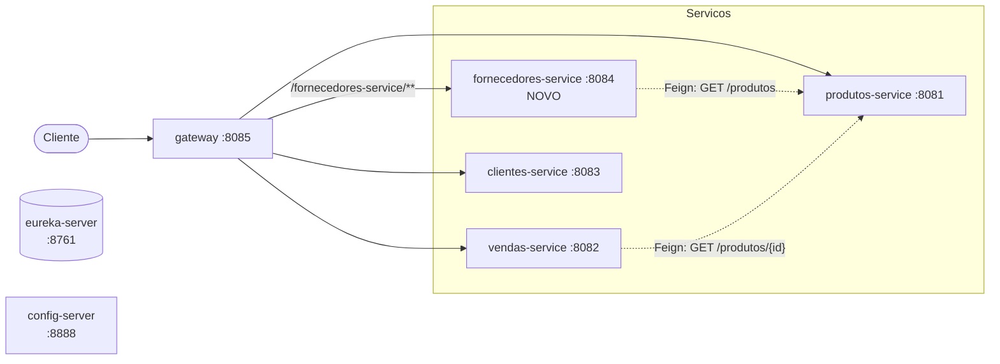

Todos os serviços se registram no Eureka e recebem porta, banco e endereço do Eureka do Config
Server. O gateway não tem rotas escritas: o *discovery locator* cria uma rota para cada serviço
registrado, com o nome dele em minúsculas como prefixo.

### O fornecedores-service por dentro

```text
fornecedores-service/src/main/java/com/exemplo/fornecedoresservice/
├── FornecedoresServiceApplication.java   @EnableDiscoveryClient + @EnableFeignClients
├── model/
│   ├── Fornecedor.java                   entidade JPA; criada só por Fornecedor.novo(...)
│   ├── Cnpj.java                         objeto de valor: valida e normaliza o CNPJ
│   └── CnpjConverter.java                grava o Cnpj formatado na coluna
├── repository/FornecedorRepository.java  JpaRepository + existsByCnpj
├── config/DataInitializer.java           cinco fornecedores na subida
├── service/
│   ├── FornecedorService.java            regra de negócio, transacional
│   └── CatalogoProdutos.java             isola o Feign do resto do serviço
├── controller/FornecedorController.java  GET, GET /{id}, POST, GET /produtos
├── client/ProdutoClient.java             @FeignClient("produtos-service")
├── dto/                                  FornecedorRequest, FornecedorResponse, ProdutoDTO
└── exception/                            400 (CNPJ inválido), 409 (repetido), 503 (produtos)
```

A organização em camadas (`controller`, `service`, `repository`, `model`) é a mesma dos serviços
da base, de propósito: o enunciado manda copiar o clientes-service, e o avaliador compara um com o
outro. Dentro dessas camadas, o serviço usa as práticas de modelagem que cabem num CRUD deste
tamanho (seção 15): objeto de valor para o CNPJ, método de fábrica na entidade, DTOs na fronteira
HTTP e uma camada anticorrupção na integração com o produtos-service.

---

## 3. Exercício 1: fork, clone e Eureka

1. Fork de `brunowbbs2/api-vendas` para `andrebecker84/microservices-devops-api-vendas-AT`, com
   todas as branches.
2. `main` do fork apontada para a V5.
3. Clone do fork na máquina local.
4. Eureka, Config Server e produtos-service no ar.

O enunciado pede para subir só o Eureka e o produtos-service. Nesta entrega, o Config Server também
sobe antes do produtos-service, porque é dele que vem a porta 8081. Sem ele, o import
`optional:configserver:` deixa o serviço subir na porta 8080 padrão. Ele se registra no Eureka mesmo
assim, porque o endereço padrão do cliente Eureka já é `localhost:8761`.

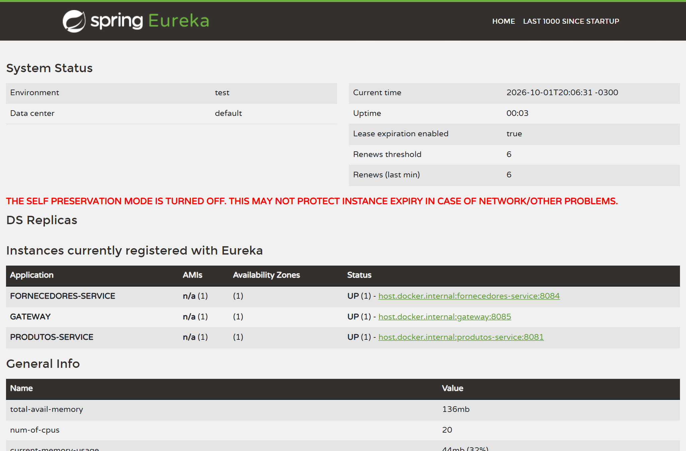

*Figura 1 — Painel do Eureka em `localhost:8761` com o `PRODUTOS-SERVICE` registrado.*

---

## 4. Exercício 2: branch, readme.md e Pull Request

| Passo | Resultado |
|---|---|
| Branch | `atividade-andrebecker` |
| `readme.md` | o arquivo do professor foi mantido e recebeu a linha `Aluno: André Luis Becker · Matrícula (CPF): ***.***.***-**`, um aviso explicando por que o CPF não é publicado e os links para a documentação completa ([`README_AT.md`](../README_AT.md)) e para este relatório |
| Commit e push | primeiro commit da branch, só com essa alteração no `readme.md` |
| Pull Request | `atividade-andrebecker` → `main` do próprio fork |

Todos os commits seguintes estão nessa mesma branch. A documentação completa do projeto fica em
`README_AT.md`, para que o `readme.md` mostre ao avaliador, logo na abertura do repositório, exatamente
o que o Exercício 2 pede.

> [!NOTE]
> **Matrícula não publicada.** No Instituto Infnet, a matrícula do aluno é o CPF. Como o repositório
> é público e o histórico do Git guarda cada commit para sempre, **nenhum dígito do CPF é
> publicado**, nem os seis dígitos do meio que o governo exibe em documentos públicos. Um CPF
> parcial ao lado do nome completo já facilita fraude e engenharia social, e máscaras diferentes,
> publicadas em lugares diferentes, podem ser cruzadas até reconstruir o número inteiro. É o
> princípio da necessidade da LGPD (Lei nº 13.709/2018, art. 6º, III): tratar só o dado necessário
> à finalidade, que aqui é identificar o aluno. O nome completo e a conta do GitHub cumprem essa
> finalidade. O número não aparece no repositório nem no documento de entrega e é informado ao
> professor mediante solicitação.

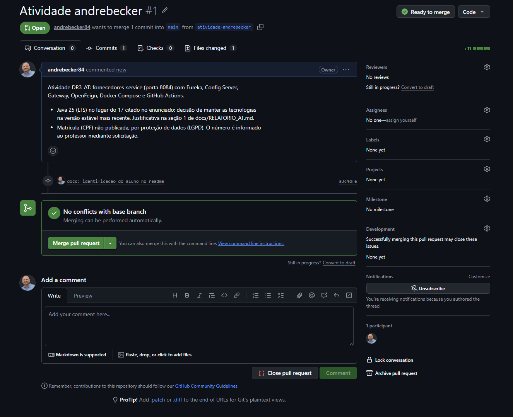

*Figura 2 — Pull Request da branch `atividade-andrebecker` para a `main` do fork.*

---

## 5. Exercício 3: o novo microsserviço

O `fornecedores-service` nasceu da cópia do `clientes-service`, com os ajustes pedidos:

| Item | clientes-service | fornecedores-service |
|---|---|---|
| `artifactId` / `name` | `cliente-service` | `fornecedores-service` |
| Pacote | `com.exemplo.clientesservice` | `com.exemplo.fornecedoresservice` |
| Classe principal | `ClienteServiceApplication` | `FornecedoresServiceApplication` |
| `spring.application.name` | `clientes-service` | `fornecedores-service` |
| Porta | 8083 | **8084** |

Além da cópia, o `pom.xml` do novo serviço já nasce com o que os exercícios seguintes pedem:
`spring-boot-starter-validation` (campos obrigatórios no `POST`) e `spring-cloud-starter-openfeign`
(Exercício 10).

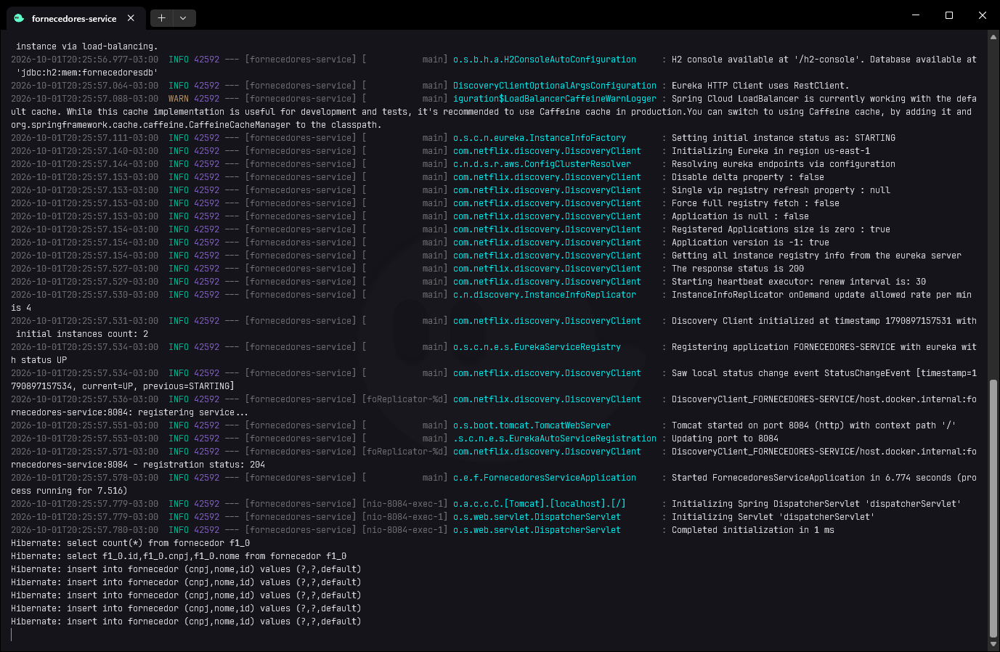

*Figura 3 — O fornecedores-service iniciado no terminal: `Tomcat started on port 8084`.*

---

## 6. Exercício 4: entidade, repositório e carga inicial

A entidade `Fornecedor` segue o modelo de `Cliente`, com `cnpj` no lugar de `email`:

```java
@Entity
@Table(name = "fornecedor")
public class Fornecedor {
    @Id
    @GeneratedValue(strategy = GenerationType.IDENTITY)
    private Long id;

    @Column(nullable = false, length = TAMANHO_MAXIMO_NOME)
    private String nome;

    @Convert(converter = CnpjConverter.class)
    @Column(nullable = false, unique = true, length = 18)
    private Cnpj cnpj;

    protected Fornecedor() { }                               // exigido pelo JPA

    public static Fornecedor novo(String nome, Cnpj cnpj) { ... }
}
```

- **Id gerado automaticamente:** `IDENTITY`, gerado pelo banco. A entidade não tem `setId`, e o
  único jeito de criá-la é `Fornecedor.novo(...)`: nenhum código consegue escolher o id.
- **Nome obrigatório:** `nullable = false` na coluna, `@NotBlank` na requisição e checagem no
  método de fábrica.
- **CNPJ obrigatório e único:** `nullable = false, unique = true`. O Hibernate cria a constraint
  `UNIQUE` na tabela.

### O CNPJ como objeto de valor

Um `String` com `unique = true` não garante CNPJ único: `11.222.333/0001-81` e `11222333000181` são
o mesmo número, mas passariam pela constraint como valores diferentes. E nada impediria gravar
`abc` como CNPJ. Por isso o campo é do tipo [`Cnpj`](../fornecedores-service/src/main/java/com/exemplo/fornecedoresservice/model/Cnpj.java),
um `record` que só existe em estado válido:

- `Cnpj.of(...)` aceita a entrada com ou sem máscara, remove pontuação e passa para maiúsculas;
- confere os **dois dígitos verificadores** (módulo 11 da Receita) e recusa sequências repetidas,
  como `00.000.000/0000-00`;
- aceita o **CNPJ alfanumérico**, que a Receita Federal emite desde julho de 2026: os 12 primeiros
  caracteres podem ser letras, e cada caractere vale o código ASCII menos 48. O teste usa o exemplo
  publicado pela Receita, `12.ABC.345/01DE-35`;
- o [`CnpjConverter`](../fornecedores-service/src/main/java/com/exemplo/fornecedoresservice/model/CnpjConverter.java)
  grava sempre a forma formatada. Como toda entrada passa pela normalização, a constraint `UNIQUE`
  vale para o **número**, e não para a grafia.

O `FornecedorRepository` estende `JpaRepository<Fornecedor, Long>` e acrescenta `existsByCnpj(Cnpj)`,
usado pelo `POST`. O `DataInitializer`, um `CommandLineRunner` como o do clientes-service, grava cinco
fornecedores na subida com `saveAll`. Os CNPJs são fictícios, mas com dígitos verificadores válidos.

| id | Nome | CNPJ |
|:---:|---|---|
| 1 | Alfa Distribuidora de Informatica Ltda | 11.222.333/0001-81 |
| 2 | Beta Perifericos e Acessorios Ltda | 24.567.890/0001-86 |
| 3 | Gama Monitores e Video S.A. | 31.827.364/0001-73 |
| 4 | Delta Moveis para Escritorio Ltda | 42.738.495/0001-09 |
| 5 | Epsilon Eletronicos Importadora Ltda | 53.948.506/0001-93 |

O console do H2 fica em `http://localhost:8084/h2-console`, com a JDBC URL
`jdbc:h2:mem:fornecedoresdb`, o usuário `sa` e a senha em branco.

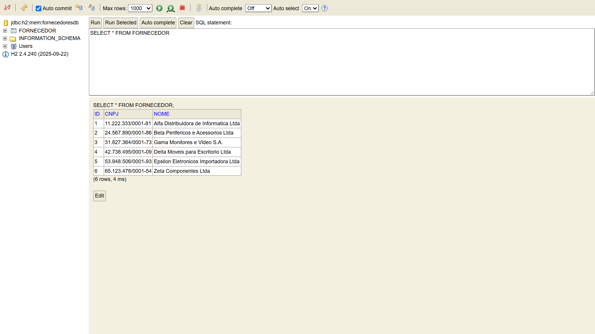

*Figura 4 — H2 Console com `SELECT * FROM FORNECEDOR` mostrando os cinco registros da carga inicial.*

---

## 7. Exercício 5: service, controller e o 404

O controller não fala com o repositório: chama o `FornecedorService`, como nos outros serviços. A
busca por id reproduz o `ProdutoController`:

```java
@GetMapping("/{id}")
public ResponseEntity<FornecedorResponse> buscarPorId(@PathVariable Long id) {
    return fornecedorService.buscarPorId(id)
            .map(FornecedorResponse::de)
            .map(ResponseEntity::ok)
            .orElseGet(() -> ResponseEntity.notFound().build());
}
```

O `Optional` vazio vira `404 Not Found`, sem corpo e sem exceção. A diferença em relação ao
produtos-service é que a entidade JPA não sai pela API: o controller converte para
`FornecedorResponse`, um `record` com `id`, `nome` e `cnpj` formatado. Assim, mudar a entidade não
muda o contrato HTTP, e vice-versa.

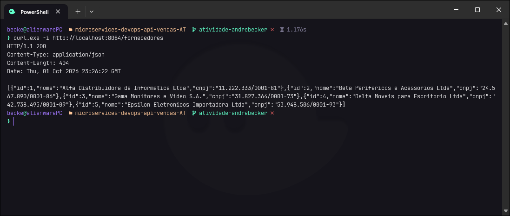

*Figura 5 — `GET /fornecedores` respondendo `200` com os cinco fornecedores.*

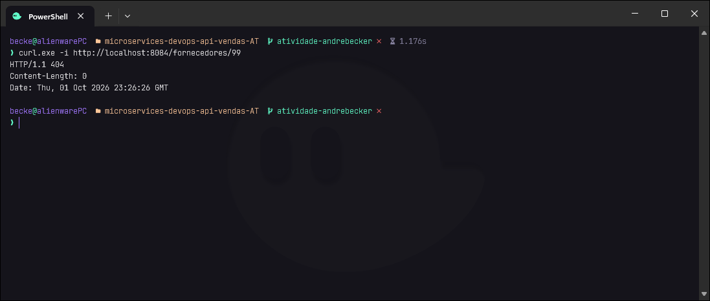

*Figura 6 — `GET /fornecedores/99`, um id que não existe, respondendo `404`.*

---

## 8. Exercício 6: registro no Eureka

| Peça | Onde |
|---|---|
| Dependência | `spring-cloud-starter-netflix-eureka-client` no `pom.xml` |
| Anotação | `@EnableDiscoveryClient` na classe principal (opcional no Spring Cloud atual, mantida como nos outros serviços) |
| Propriedades | `eureka.client.service-url.defaultZone`, `register-with-eureka`, `fetch-registry` e `eureka.instance.prefer-ip-address` em `config-repo/fornecedores-service.properties` |

O `fetch-registry=true` não serve só para aparecer no painel: é ele que baixa a lista de serviços e
permite ao Feign encontrar o produtos-service pelo nome, no Exercício 10.


*Figura 7 — Eureka com o `FORNECEDORES-SERVICE` registrado, `UP`, na porta 8084.*

---

## 9. Exercício 7: configuração no Config Server

O `application.properties` do serviço ficou só com as duas linhas pedidas:

```properties
spring.application.name=fornecedores-service
spring.config.import=optional:configserver:http://localhost:8888
```

Todo o resto está em [`config-repo/fornecedores-service.properties`](../config-repo/fornecedores-service.properties):
porta 8084, datasource H2, JPA, console do H2 e Eureka. O Config Server usa o nome da aplicação para
achar o arquivo, e a configuração pode ser pedida direto a ele:

```text
http://localhost:8888/fornecedores-service/default
```

> [!NOTE]
> Para o Exercício 7 funcionar em qualquer máquina, foi preciso corrigir o Config Server herdado. Ele
> apontava para `file:///Users/wesley/Documents/spring-microservices-exercicio/config-repo`, um
> caminho que só existe no computador do professor. Agora usa o backend `native`, que lê
> `./config-repo` ou `../config-repo` por caminho relativo (seção 15).

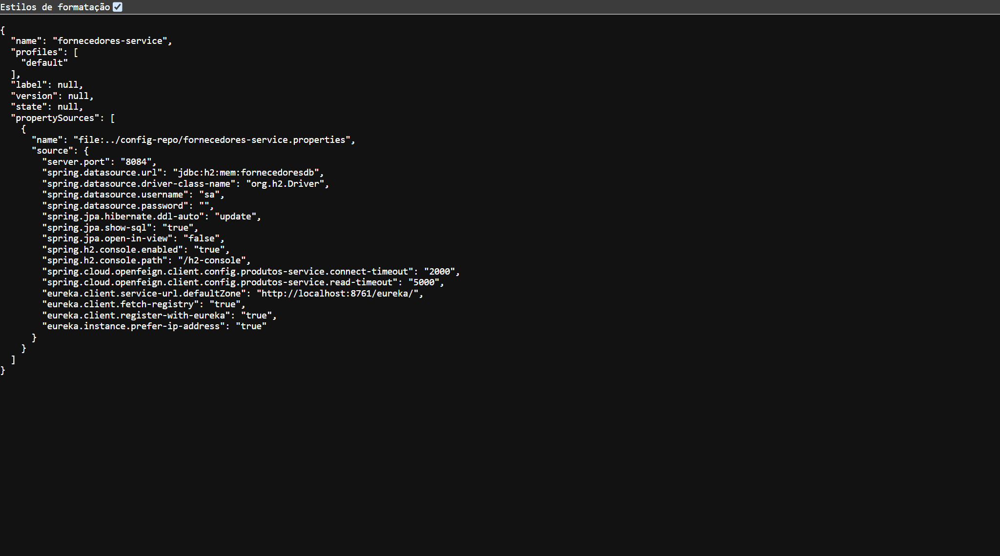

*Figura 8 — Resposta do Config Server em `/fornecedores-service/default`, com as propriedades de
`fornecedores-service.properties`, entre elas `server.port: 8084`.*

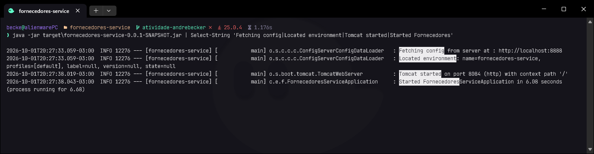

*Figura 9 — Log de subida do fornecedores-service: `Fetching config from server at :
http://localhost:8888`, `Located environment: name=fornecedores-service` e `Tomcat started on port
8084`. A porta não está no projeto: veio do Config Server.*

---

## 10. Exercício 8: acesso pelo gateway

O gateway da V5 já tem o *discovery locator* ligado:

```properties
spring.cloud.gateway.server.webflux.discovery.locator.enabled=true
spring.cloud.gateway.server.webflux.discovery.locator.lower-case-service-id=true
```

Para cada serviço registrado no Eureka, ele cria sozinho a rota `/<nome-do-servico>/**`, repassada
ao serviço sem o prefixo. Não foi preciso escrever nenhuma rota:

```text
http://localhost:8085/fornecedores-service/fornecedores  →  fornecedores-service /fornecedores
```

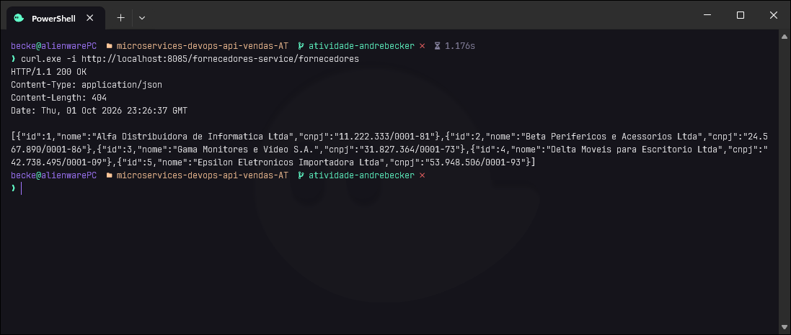

*Figura 10 — A lista de fornecedores servida pela porta 8085, através do gateway.*

---

## 11. Exercício 9: `POST /fornecedores`

```java
@PostMapping
public ResponseEntity<FornecedorResponse> cadastrar(@Valid @RequestBody FornecedorRequest request) {
    FornecedorResponse criado = FornecedorResponse.de(
            fornecedorService.cadastrar(request.nome(), request.cnpj()));
    return ResponseEntity.created(URI.create("/fornecedores/" + criado.id())).body(criado);
}
```

`ResponseEntity.created(...)` devolve `201 Created`, com o header `Location` apontando para o novo
recurso e o objeto salvo, já com o id gerado, no corpo.

O corpo é um `FornecedorRequest` (`nome` e `cnpj`), e não a entidade. Receber a entidade direto no
`@RequestBody` é *mass assignment*: o cliente HTTP escolheria o `id`, e o `save()` do JPA
**atualizaria** o fornecedor existente em vez de criar outro.

Os casos de erro que um `POST` precisa tratar:

| Situação | Sem tratamento | Com tratamento |
|---|---|---|
| JSON com `"id": 1` | o `save()` do JPA sobrescreveria o fornecedor 1 | o `FornecedorRequest` não tem `id`: o campo é ignorado |
| CNPJ já cadastrado, em qualquer grafia | `500`, ou cadastro duplicado se a máscara for outra | `409 Conflict` |
| CNPJ com dígito verificador errado | gravado sem conferência | `400 Bad Request` |
| Sem nome ou sem CNPJ | `500` ao gravar | `400 Bad Request`, pelo `@Valid` |
| JSON malformado | `400` sem corpo explicativo | `400` em Problem Details |

Todos os erros saem no formato **Problem Details** (RFC 9457): o `ApiExceptionHandler` estende o
`ResponseEntityExceptionHandler` do Spring, que já cobre os erros do próprio Spring MVC, e acrescenta
os do domínio.

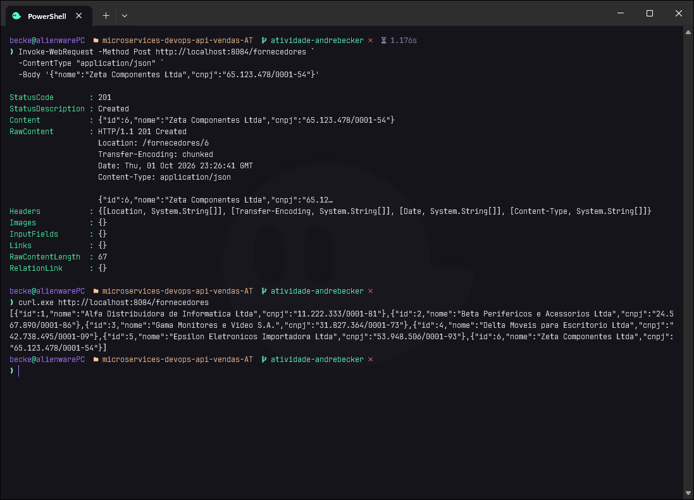

*Figura 11 — `POST /fornecedores` respondendo `201 Created` com o id 6 do novo registro, que em
seguida aparece no `GET /fornecedores`.*

---

## 12. Exercício 10: Feign para o produtos-service

Os quatro passos do enunciado:

| Passo | Implementação |
|---|---|
| Dependência | `spring-cloud-starter-openfeign` no `pom.xml` |
| Habilitar os clientes | `@EnableFeignClients` na classe principal |
| Interface e DTO | [`ProdutoClient`](../fornecedores-service/src/main/java/com/exemplo/fornecedoresservice/client/ProdutoClient.java) e [`ProdutoDTO`](../fornecedores-service/src/main/java/com/exemplo/fornecedoresservice/dto/ProdutoDTO.java) |
| Endpoint | `GET /fornecedores/produtos` |

```java
@FeignClient(name = "produtos-service")
public interface ProdutoClient {
    @GetMapping("/produtos")
    List<ProdutoDTO> listarTodos();
}
```

É o mesmo caminho do `ProdutoInterface` do vendas-service, que chama `GET /produtos/{id}`. Aqui o
método chamado é `GET /produtos`. O `name` é o nome registrado no Eureka: o Spring Cloud LoadBalancer
troca esse nome por uma instância real, sem IP nem porta no código.

O `ProdutoDTO` é um `record` com os campos que interessam (`id`, `nome`, `preco`), e o preço é
`BigDecimal`, o mesmo tipo usado no produtos-service.

### Camada anticorrupção

O controller não chama o Feign direto. Entre os dois fica o
[`CatalogoProdutos`](../fornecedores-service/src/main/java/com/exemplo/fornecedoresservice/service/CatalogoProdutos.java),
que traduz as falhas da integração para o vocabulário do próprio serviço:

```java
public List<ProdutoDTO> listarTodos() {
    try {
        return produtoClient.listarTodos();
    } catch (FeignException e) {
        log.warn("Falha ao consultar o produtos-service: status={} {}", e.status(), e.getMessage());
        throw new ProdutosIndisponiveisException(e);
    }
}
```

Com isso, a camada web só conhece `ProdutosIndisponiveisException`, convertida em **`503
produtos-service indisponivel`**. Sem essa tradução, qualquer erro do Feign viraria um `500`
genérico, e o tratamento de erro HTTP ficaria acoplado à biblioteca de integração. O caso foi testado
de verdade: com o produtos-service derrubado, o endpoint respondeu `503` em `application/problem+json`.

O `FornecedorService` cuida só de fornecedores. Consultar o catálogo de outro serviço é outra
responsabilidade, e por isso fica numa classe separada.

### Timeouts

Sem configuração, o Feign espera até **60 segundos** pela resposta. Um produtos-service travado
seguraria cada requisição por um minuto inteiro. O config-repo limita a conexão a 2 s e a leitura a
5 s:

```properties
spring.cloud.openfeign.client.config.produtos-service.connect-timeout=2000
spring.cloud.openfeign.client.config.produtos-service.read-timeout=5000
```

### OpenFeign e a alternativa mais nova

Desde o Spring Cloud 2022.0, o próprio Spring trata o OpenFeign como *feature-complete*: o projeto
só recebe correções, e a recomendação para código novo são os **HTTP Service Clients** do Spring
Framework (`@HttpExchange` sobre o `RestClient`). O Feign foi mantido porque o Exercício 10 e o
critério 1.4 da rúbrica pedem o Spring Cloud OpenFeign pelo nome. Numa migração, a interface
`ProdutoClient` trocaria `@FeignClient` e `@GetMapping` por `@HttpExchange` e `@GetExchange`, e o
`CatalogoProdutos` não mudaria: a camada anticorrupção isola o resto do serviço dessa escolha.

### Rotas

`GET /fornecedores/produtos` e `GET /fornecedores/{id}` convivem, porque o Spring MVC dá preferência
ao caminho literal sobre a variável.

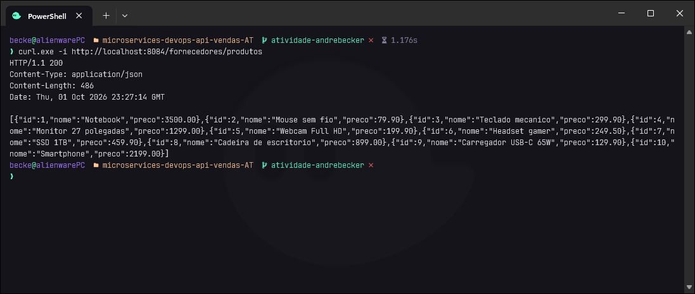

*Figura 12 — `GET /fornecedores/produtos` devolvendo os dez produtos do produtos-service, obtidos
via Feign.*

---

## 13. Exercício 11: Docker e Docker Compose

### Dockerfile

[`fornecedores-service/Dockerfile`](../fornecedores-service/Dockerfile) é o do clientes-service com a
porta trocada para `EXPOSE 8084`. É um *multi-stage build*:

1. **build:** `maven:3.9-eclipse-temurin-25` baixa as dependências numa camada própria (reaproveitada
   enquanto o `pom.xml` não muda) e gera o `.jar`;
2. **runtime:** `eclipse-temurin:25-jre` recebe só o `.jar`, sem Maven e sem código-fonte, e roda
   com um usuário sem privilégio (`USER app`), e não como root.

### Perfil docker

Dentro da rede do Docker, `localhost` é o próprio container. O arquivo
[`fornecedores-service-docker.properties`](../config-repo/fornecedores-service-docker.properties),
servido pelo Config Server quando o perfil `docker` está ativo, troca o endereço do Eureka pelo nome
do container:

```properties
eureka.client.service-url.defaultZone=http://eureka-server:8761/eureka/
```

### Bloco no Compose

```yaml
  fornecedores-service:
    build: ./fornecedores-service
    container_name: fornecedores-service
    depends_on:
      eureka-server:
        condition: service_healthy
      config-server:
        condition: service_healthy
    environment:
      - SPRING_CONFIG_IMPORT=optional:configserver:http://config-server:8888
      - SPRING_PROFILES_ACTIVE=docker
    ports:
      - "8084:8084"
    networks:
      - microservicos-net
```

Ele segue o bloco do clientes-service. Quem entrega a URL do Eureka dentro da rede é o perfil
`docker`, como o enunciado pede. A variável `EUREKA_CLIENT_SERVICEURL_DEFAULTZONE`, que a base
repetia em cada serviço, não tinha efeito (seção 15) e foi retirada de todos os blocos.

### Um único comando

```bash
docker compose up --build
```

Sobem sete containers. O `depends_on` com `condition: service_healthy` faz os serviços esperarem o
Eureka e o Config Server ficarem prontos, e não apenas criados. Sem isso, um serviço podia buscar a
configuração antes de o Config Server responder e subir na porta errada.

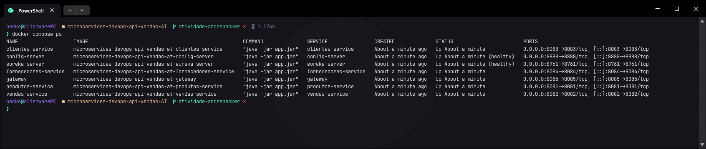

*Figura 13 — `docker compose ps` com os sete containers em execução, entre eles o
`fornecedores-service` na porta 8084.*

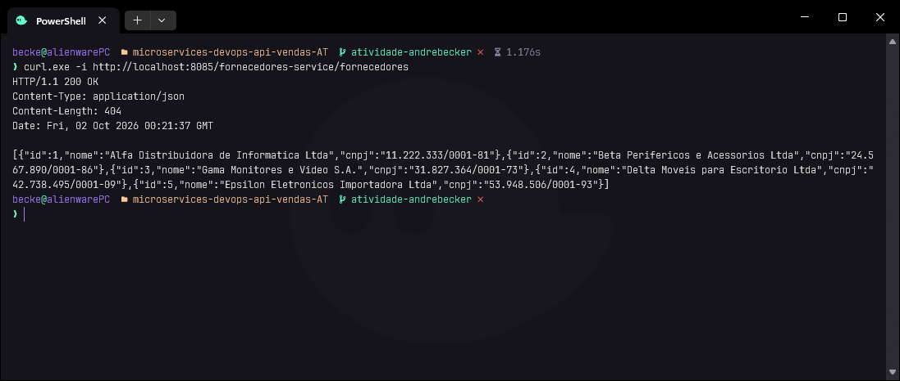

*Figura 14 — Com o ambiente no Docker, a lista de fornecedores pelo gateway em
`localhost:8085/fornecedores-service/fornecedores`.*

---

## 14. Exercício 12: GitHub Actions

[`.github/workflows/fornecedores-service.yml`](../.github/workflows/fornecedores-service.yml):

```yaml
on:
  push:
  workflow_dispatch:

jobs:
  build:
    runs-on: ubuntu-latest
    defaults:
      run:
        working-directory: fornecedores-service
    steps:
      - uses: actions/checkout@v7
      - uses: actions/setup-java@v6
        with:
          distribution: temurin
          java-version: '25'
          cache: maven
          cache-dependency-path: fornecedores-service/pom.xml
      - run: mvn -B verify
```

| Pedido do enunciado | Como foi atendido |
|---|---|
| A cada push | `on: push`, sem filtro de branch |
| Baixar o código | `actions/checkout@v7` |
| Instalar o Java | `actions/setup-java@v6`, Temurin 25 no lugar do 17 (justificativa na seção 1), com cache do `~/.m2` |
| Compilar com o Maven | `mvn -B verify`: compila, roda os testes e empacota |

O `verify` vai além do `compile` pedido: um pipeline que só compila fica verde mesmo com o `404` ou o
`201` quebrados. Os testes do serviço (seção 16) rodam no runner sem precisar de Eureka, Config
Server ou produtos-service. Os relatórios ficam anexados à execução como artefato.

O workflow também segue três boas práticas de CI:

- **Permissão mínima.** `permissions: contents: read`: o token do GitHub usado pelo pipeline não
  consegue escrever no repositório, mesmo que uma ação de terceiros seja comprometida.
- **Concorrência.** Dois pushes seguidos na mesma branch cancelam a execução antiga.
- **Timeout.** `timeout-minutes: 15` impede que um build travado consuma os minutos do runner por
  até 6 horas, o limite padrão.

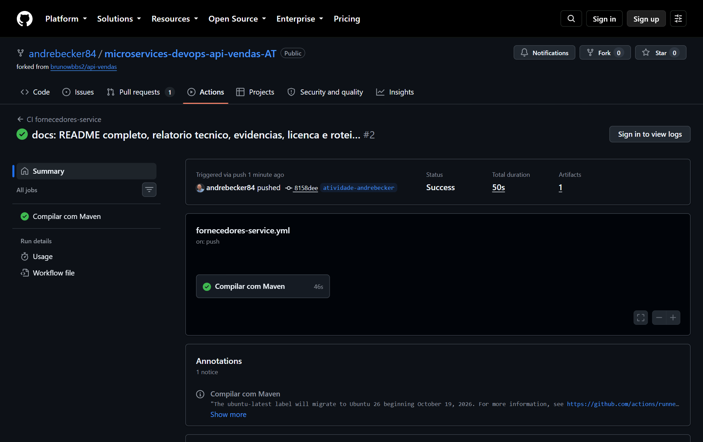

*Figura 15 — Aba Actions do repositório com o workflow `CI fornecedores-service` concluído com o
check verde.*

---

## 15. Auditoria, atualização de versões e correções

Depois de pronto, o repositório inteiro passou por uma auditoria: o serviço novo, a base herdada, a
infraestrutura e o pipeline. O critério foi corrigir o que tem efeito real (defeito, falha de
segurança, código morto ou enganoso) e não aplicar padrões por aplicar. DDD tático, métodos de
fábrica e SOLID entraram onde resolvem um problema concreto deste código. Um CRUD de três endpoints
não ganha nada com agregados, eventos de domínio ou arquitetura hexagonal completa, e essa estrutura
afastaria o serviço do modelo que o enunciado manda copiar.

### fornecedores-service

| Achado | Problema | Correção |
|---|---|---|
| Entidade recebida no `@RequestBody` | *Mass assignment*: o cliente escolhia o `id`, e um `POST` podia sobrescrever outro fornecedor. O serviço contornava zerando o id do objeto recebido | `FornecedorRequest` sem `id`; entidade sem `setId` |
| Entidade devolvida pela API | Contrato HTTP acoplado ao modelo JPA; a ordem dos campos exigia anotação do Jackson na entidade | `FornecedorResponse` |
| CNPJ como `String` | Duas grafias do mesmo CNPJ furavam a constraint `UNIQUE`; nenhum dígito verificador era conferido | Objeto de valor `Cnpj`, com suporte ao CNPJ alfanumérico |
| Construtor público e setters na entidade | Modelo anêmico: qualquer código montava um fornecedor inválido | Construtor `protected` para o JPA e método de fábrica `Fornecedor.novo` |
| `FornecedorService` chamava o Feign | Duas responsabilidades na mesma classe (SRP) | `CatalogoProdutos`, camada anticorrupção |
| `@ExceptionHandler(FeignException)` na camada web | Web acoplada à biblioteca de integração; nenhum log da falha | Exceção de domínio `ProdutosIndisponiveisException`, com log do status recebido |
| `DataIntegrityViolationException` virava "CNPJ ja cadastrado" | A mensagem afirmava uma causa que podia não ser a verdadeira | Mensagem genérica de conflito |
| Erros do Spring MVC fora do padrão | `400` de validação e de JSON malformado sem corpo explicativo | `ApiExceptionHandler` estende `ResponseEntityExceptionHandler`: tudo em Problem Details |
| Sem transação declarada | `existsByCnpj` e `save` em transações separadas | `@Transactional(readOnly = true)` na classe e `@Transactional` no cadastro |
| Feign sem timeout | Um produtos-service travado segurava a requisição por 60 s | 2 s de conexão e 5 s de leitura no config-repo |
| Testes com `@DirtiesContext` a cada método | O contexto do Spring subia nove vezes | `@Transactional` com rollback: um contexto para a classe inteira |

### vendas-service (herdado)

| Achado | Problema | Correção |
|---|---|---|
| Preço em `Double` | Dinheiro em ponto flutuante: `0.1 + 0.2` dá `0.30000000000000004` | `BigDecimal`, com precisão 12 e escala 2 na coluna |
| `GET /vendas` devolvia `"ESTOU AQUI!"` | Resto de depuração numa rota pública | Lista as vendas |
| `POST /vendas` devolvia `200` | A venda é criada: o status certo é `201`, com `Location` | `ResponseEntity.created(...)` |
| `if (produto == null)` depois do Feign | Código morto: o Feign lança `FeignException.NotFound` no 404 e nunca devolve `null`. Produto inexistente virava `500` | `422` para produto inexistente e `503` para produtos-service fora do ar |
| Quantidade sem validação | Aceitava `0` e negativos | `@Positive` no `VendaRequest` e checagem no método de fábrica `Venda.registrar` |
| `VendaDTO` como corpo do `POST` | O cliente podia mandar `id` e `preco` | `VendaRequest` só com `idProduto` e `quantidade`; o preço vem sempre do produtos-service |
| `@Data` do Lombok na entidade JPA | `equals`/`hashCode` sobre campos mutáveis e `setId` público | Getters explícitos e construtor `protected`; o Lombok saiu do projeto |
| `pom.xml` com dois `executions` do compilador só para o Lombok e blocos vazios do Initializr | Configuração sem função | Removidos |

O nome `ProdutoInterface` e o pacote `interfaces` foram mantidos, porque o enunciado cita esse
cliente Feign como referência para o Exercício 10.

### clientes-service e produtos-service (herdados)

- `ClienteController` importava `ResponseEntity` e `PathVariable` sem usar, e o
  `ClienteService.buscarPorId` nunca era chamado: o `GET /clientes/{id}` ficou pela metade na base.
  Foi completado no mesmo padrão do produtos-service.
- Import de `BigDecimal` sem uso em `Cliente`.
- `@Repository` redundante em interfaces do Spring Data, que o Spring já detecta por estenderem
  `JpaRepository`.
- Um bloco de comentário com o enunciado de uma aula anterior no fim de
  `ProdutosServiceApplication`.

### Migração para o Spring Boot 4

O produtos-service e o clientes-service estavam no Spring Boot 3.2.5. No 4.x, dois ajustes foram
necessários:

| Boot 3 | Boot 4 | Motivo |
|---|---|---|
| `spring-boot-starter-web` | `spring-boot-starter-webmvc` | o starter foi renomeado |
| console do H2 dentro do Boot | dependência `spring-boot-h2console` | a autoconfiguração do console virou módulo próprio. Sem ele, `spring.h2.console.enabled=true` não tem efeito |

No config-repo, saiu `spring.jpa.database-platform=org.hibernate.dialect.H2Dialect`, que o Hibernate 7
considera desnecessário e aponta com um aviso na subida. Entrou `spring.jpa.open-in-view=false`, que
fecha a sessão do JPA junto com a transação, e não no fim da requisição HTTP.

Numa execução local, os sete módulos subiram juntos com Java 25 e responderam como esperado,
inclusive o `POST /vendas` chamando o produtos-service via Feign.

### Infraestrutura

- **Config Server fora do Docker.** O caminho do `config-repo` era o da máquina do professor. Agora o
  backend `native` usa um caminho relativo. O Compose já usava `native`, com a pasta montada em
  `/config-repo`.
- **Corrida na subida.** O `depends_on` simples espera o container ser criado, não a aplicação ficar
  pronta. Com o import `optional:`, um serviço que buscasse a configuração antes do Config Server
  responder subia na porta 8080, sem Eureka, e a porta publicada no Compose apontava para o vazio.
  Agora o Eureka e o Config Server têm healthcheck. Como a imagem JRE não tem `curl`, o teste abre
  uma conexão TCP com o próprio `bash` (`/dev/tcp`). Os serviços esperam `service_healthy`.
- **Eureka no Compose.** Pelo *relaxed binding*, `EUREKA_CLIENT_SERVICEURL_DEFAULTZONE` vira a chave
  `defaultzone`, em minúsculas, dentro do mapa `serviceUrl`, e o Eureka procura `defaultZone`. Nos
  serviços de negócio a variável não causava dano, porque o perfil `docker` do config-repo entrega a
  URL certa, mas enganava quem lesse o arquivo, e o comentário ao lado dela afirmava que funcionava.
  Saiu de todos. O gateway, que não usa o Config Server, continuava procurando o Eureka em
  `localhost`; a URL dele agora chega por `SPRING_APPLICATION_JSON`, a mesma solução que a base usa
  nos manifestos do Kubernetes. O bloco do clientes-service também citava, por cópia,
  `vendas-service-docker.properties`.
- **Containers como root.** Os Dockerfiles não definiam usuário. Os sete passaram a criar e usar um
  usuário sem privilégio, de modo que uma falha explorada na aplicação não vira root no container.
- **ConfigMap do Kubernetes.** O manifesto `k8s/02-config-server.yaml` embute uma cópia dos arquivos
  do config-repo num ConfigMap, e essa cópia não tinha os arquivos do fornecedores-service. No
  cluster, o serviço subiria sem H2 nomeado, sem console e sem os timeouts do Feign. O ConfigMap
  passou a incluir os dois arquivos e foi ressincronizado com o config-repo: sem o dialeto explícito
  do H2 e com `open-in-view` desligado.

### Comparação com a branch `v10` do professor

A `v10` é a branch mais recente de `brunowbbs2/api-vendas`. Ela tem quatro commits a mais que a
V5, e cada um foi conferido contra esta entrega:

| Commit da `v10` | O que traz | Situação nesta entrega |
|---|---|---|
| `fix(config-server)` | Backend `native` com `./config-repo` e `../config-repo` | Já aplicado, com o mesmo conteúdo. |
| `feat: auth-service` | Cadastro de usuários na porta **8084**, ConfigMap e manifesto `k8s/07-auth-service.yaml` | Não incorporado: o enunciado reserva a 8084 ao fornecedores-service e não pede autenticação. |
| `feat: JWT no gateway` | `TokenFilter` que exige token em todas as rotas | Não incorporado: com ele, o `GET` pelo gateway do Exercício 8 responderia `401` sem um login que a atividade não prevê. |
| `docs: guias` | Links para os guias de deploy na Oracle Cloud e de GitHub Actions | O guia de Actions usa uma matriz com todos os serviços e um deploy por SSH. O Exercício 12 pede só o build do fornecedores-service, que é o que o workflow faz. |

A comparação também mostrou um padrão que esta entrega não seguia: ao criar o `auth-service`, a
`v10` acrescenta os arquivos dele ao ConfigMap do Kubernetes. O fornecedores-service precisava do
mesmo, e é a correção do item anterior.

---

## 16. Testes automatizados

[`FornecedorControllerTest`](../fornecedores-service/src/test/java/com/exemplo/fornecedoresservice/controller/FornecedorControllerTest.java)
sobe a aplicação inteira com `@SpringBootTest` e MockMvc, com a carga inicial real no H2. O Config
Server e o Eureka ficam desligados por propriedade, e o `ProdutoClient` é substituído por um mock
(`@MockitoBean`). Cada teste roda numa transação desfeita no final, então um `POST` não altera a
contagem vista pelo teste seguinte.

| Teste | Exercício | Verifica |
|---|:---:|---|
| `listaOsCincoFornecedoresCadastradosNaSubida` | 4, 5 | `200` com os cinco registros |
| `buscaFornecedorPorId` | 5 | `200` para id existente |
| `idInexistenteDevolve404` | 5 | `404` |
| `postCriaFornecedorEDevolve201ComOObjetoCriado` | 9 | `201`, `Location` e presença na listagem |
| `postGuardaOCnpjFormatadoMesmoQuandoEnviadoSemMascara` | 9 | normalização do CNPJ |
| `postIgnoraIdEnviadoNoCorpoENaoSobrescreveRegistroExistente` | 9 | o `POST` não vira atualização |
| `postComCnpjRepetidoDevolve409` | 4 | CNPJ único |
| `cnpjRepetidoEmOutraGrafiaTambemDevolve409` | 4 | CNPJ único independente da máscara |
| `postComCnpjInvalidoDevolve400` | 4 | dígito verificador |
| `postSemCnpjDevolve400` | 4 | CNPJ obrigatório |
| `postComJsonMalformadoDevolve400` | 9 | corpo inválido |
| `listaProdutosObtidosDoProdutosServiceViaFeign` | 10 | o endpoint devolve o que o Feign trouxe |
| `produtosServiceForaDoArDevolve503` | 10 | falha do Feign vira `503` |

[`ProdutoClientFeignTest`](../fornecedores-service/src/test/java/com/exemplo/fornecedoresservice/client/ProdutoClientFeignTest.java)
testa o Feign de verdade. Nos outros testes o `ProdutoClient` é um mock, o que prova o controller mas
não a integração. Aqui, o **WireMock** sobe um servidor HTTP no papel do produtos-service, e o nome
`produtos-service` é resolvido pelo Spring Cloud LoadBalancer, como em produção; só o Eureka é
trocado pela lista fixa do `SimpleDiscoveryClient`. Três casos:

| Teste | Verifica |
|---|---|
| `buscaOsProdutosNoProdutosServicePeloNomeRegistrado` | o Feign chama `GET /produtos` uma vez e o JSON vira `ProdutoDTO`, com o preço em `BigDecimal` |
| `erroNoProdutosServiceViraServicoIndisponivel` | um `500` do produtos-service chega ao cliente como `503` |
| `produtosServiceLentoEstouraOTimeoutEmVezDeTravarARequisicao` | resposta com 2 s de atraso e timeout de 0,5 s: `503`. Sem o timeout configurado, o teste receberia `200` depois de 2 s e falharia |

[`CnpjTest`](../fornecedores-service/src/test/java/com/exemplo/fornecedoresservice/model/CnpjTest.java)
testa o objeto de valor isoladamente: as duas grafias são o mesmo CNPJ, a formatação, o CNPJ
alfanumérico do exemplo da Receita e nove entradas inválidas (nula, vazia, dígito errado, tamanho
errado, sequência repetida, letra no dígito verificador e caractere fora do alfabeto).

No vendas-service, [`VendaControllerTest`](../vendas-service/src/test/java/com/example/vendas_service/controllers/VendaControllerTest.java)
cobre a venda com `201` e o preço vindo do produtos-service, produto inexistente com `422`,
produtos-service fora do ar com `503` e quantidade inválida com `400`.

| Módulo | Testes | Falhas |
|---|---:|---:|
| fornecedores-service | 28 | 0 |
| vendas-service | 6 | 0 |
| gateway | 1 | 0 |
| **Total** | **35** | **0** |

O mesmo `mvn -B verify` do fornecedores-service roda no GitHub Actions a cada push (Figura 15).

---

## 17. Atendimento à rúbrica

| # | Critério | Evidência |
|:---:|---|---|
| 1.1 | `pom.xml`, pacotes e porta 8084 | seção 5, Figura 3 |
| 1.2 | Registro no Eureka | seção 8, Figura 7 |
| 1.3 | Configuração externalizada no config-repo | seção 9, Figuras 8 e 9 |
| 1.4 | OpenFeign com o produtos-service | seção 12, Figura 12 |
| 2.1 | Dockerfile com a porta certa | seção 13 |
| 2.2 | Perfil docker apontando o Eureka | seção 13 |
| 2.3 | Bloco no `docker-compose.yml` | seção 13 |
| 2.4 | Comando único e acesso pelo gateway | seção 13, Figuras 13 e 14 |
| 3.1 | Entidade, repositório e cinco registros no H2 | seção 6, Figura 4 |
| 3.2 | `GET` com `404` | seção 7, Figuras 5 e 6 |
| 3.3 | `POST` com `201` | seção 11, Figura 11 |
| 3.4 | Acesso pelo gateway na 8085 | seção 10, Figura 10 |
| 4.1 | Fork e clone | seção 3, Figura 1 |
| 4.2 | Branch `atividade-seunome` | seção 4 (`atividade-andrebecker`) |
| 4.3 | `readme.md` com nome e matrícula | seção 4 (CPF não publicado, por LGPD) |
| 4.4 | Push e Pull Request para a `main` do fork | seção 4, Figura 2 |
| 5.1 | `.github/workflows` com o YAML | seção 14 |
| 5.2 | Gatilho a cada push | seção 14 (`on: push`) |
| 5.3 | Checkout e ambiente Java | seção 14 (Java 25 no lugar do 17, justificado na seção 1) |
| 5.4 | Compilação com Maven e check verde | seção 14, Figura 15 |

---

## 18. Limitações conhecidas

São limitações conscientes de escopo, também registradas no anexo da [LICENSE](../LICENSE):

> [!CAUTION]
> O ambiente é para estudo e **não deve ser exposto à internet**: não há autenticação, o console
> do H2 fica aberto e as portas dos serviços ficam acessíveis na rede local.

- **Sem autenticação.** O enunciado não pede, e qualquer um que alcance a porta pode cadastrar
  fornecedores.
- **Console do H2 habilitado**, com usuário `sa` sem senha. Útil para o Exercício 4, inaceitável em
  produção.
- **Dados em memória.** Cada reinício volta aos cinco fornecedores iniciais.
- **Listagem sem paginação.** `GET /fornecedores` devolve todos os registros, como o enunciado pede.
  Com volume real, a rota precisaria de `Pageable`.
- **`Location` relativo.** O header aponta para `/fornecedores/{id}`, caminho válido no próprio
  serviço. Pelo gateway, o endereço público inclui o prefixo `/fornecedores-service`, que o serviço
  não conhece.
- **Janela após a subida.** Nos primeiros ~30 segundos, o gateway e o Feign ainda podem não conhecer
  um serviço recém-registrado. É o intervalo de atualização do Eureka, não um defeito.
- **Ações do GitHub referenciadas por tag** (`@v7`, `@v6`), e não por hash de commit. É a forma
  usual, mas uma tag pode ser movida; num projeto de produção, fixar o hash protege a cadeia de
  suprimentos.
- **Kubernetes não executado.** O manifesto `k8s/07-fornecedores-service.yaml` segue o padrão dos
  demais, mas a demonstração desta entrega é no Docker Compose, como pede o enunciado.
